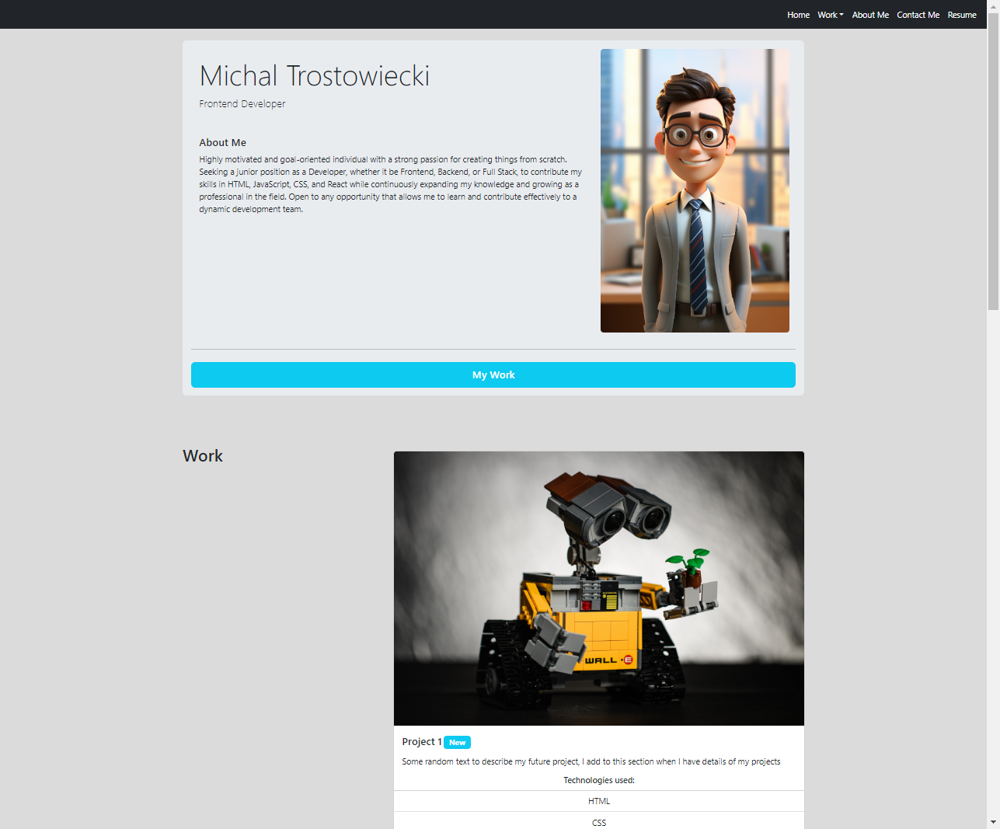

# Bootstrap-Portfolio

## Description

Portfolio Website build with Bootstrap

This small project was designed to test my newly acquired skills in Bootstrap. It also provided an opportunity to apply everything I have learned thus far in the boot camp. I thoroughly enjoyed utilizing `Bootstrap` to create a responsive layout for my portfolio website. Through this process, I learned how to use specific `.class` names to achieve different design outcomes.

I plan to continue adding to this website at a later stage, ultimately using it to showcase my skills.

## Installation 

N/A

## Usage 

Link to the website: https://michaltrostowiecki.github.io/Bootstrap-Portfolio/

## Credits

N/A

## Licence

This project is licensed under the MIT License - see the [LICENSE](LICENSE) file for details.